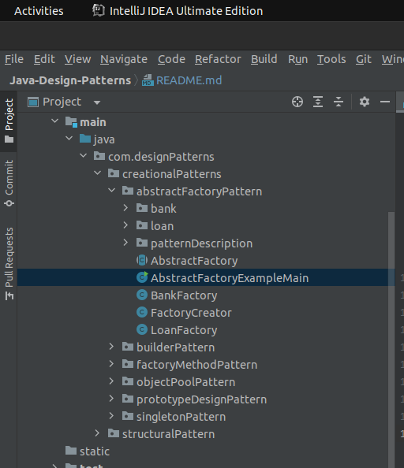

# Java-Design-Patterns

**Author:** *Engr. Irvin Gil Mercado*

This repository is created to house and demonstrate the different design patterns used in java programming.

Copyright: All the codes in this repository are referenced from the [JavaTPoint](https://www.javatpoint.com/design-patterns-in-java) website. Go check that our for
more details into Java programming design patterns.

## Pre-requisites
- Java 11
- Recommended to open and run using [INTELLIJ IDEA](https://www.jetbrains.com/idea/download/#section=linux).

## Run
There is more setup needed other than the Java version mentioned above and the recommended IDE. Just navigate through the `src/java/com.designPatterns` and there you will find the design patterns sorted and organized in their own directories.
Find the directory that is named: `/patternDescription` to read about the description of the design pattern.

In order to run the desired design pattern, find the class on the directory that has ***Main*** attached to the name. This indicated that the class is a main class of a pattern domain.
You can run the `main` class of the pattern domain, and it will work independently.

