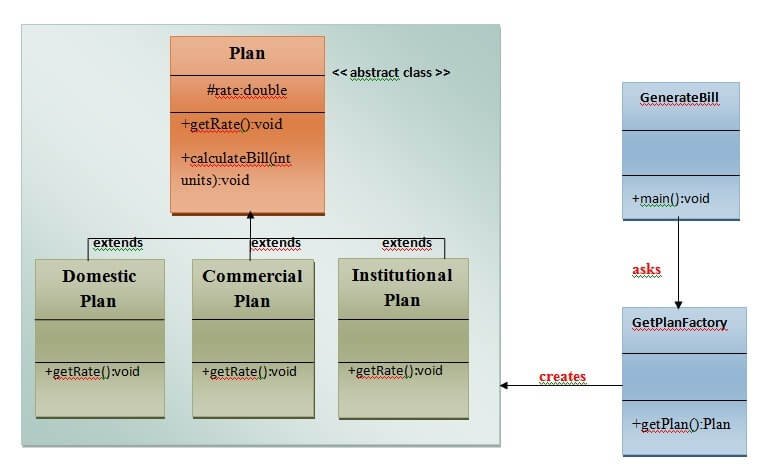

# Factory Method Pattern
A Factory pattern/Factory method pattern says that just ***define an interface or abstract class for creating an object
but let the subclasses decide which class to instantiate***. In other words, subclasses are responsible to create the 
instance of the class.

The Factory Method Pattern is also known as the **Virtual Constructor**.
### Advantage of Factory Design Pattern
* Factory Method Pattern allows the subclasses to choose the type of object to create.
* It promotes **loose-coupling** by eliminating the need to bind application-specific classes into the code. This means
the code interacts solely with the resultant interface or abstract class, so that it will work with any classes that 
implement that interface or extends that abstract class.
### Usage of Factory Design Pattern
* When a class doesn't know what subclasses will be required to create.
* When a class wants that it's subclasses specify the objects to be created.
* When the parent classes choose the creation of objects to its subclasses.
### UML for Factory Method Pattern

