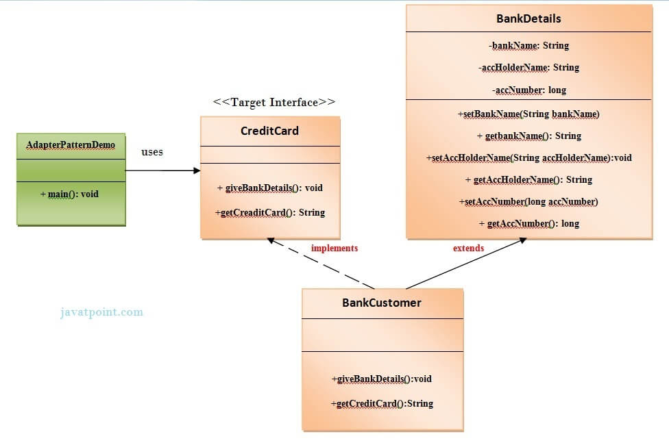

# Adapter Pattern

Adapter Pattern says that **"converts the interface of a class into another interface that a client wants"**.
In other words, to provide the interface according to the client requirement while using the services of a class with a different interface.
The Adapter Pattern is also known as **Wrapper**.

## Advantages of Adapter Pattern:
1. It allows two or more previously incompatible objects to interact.
2. It allows re-usability of existing functionality.

### Usage of Adapter Pattern:
* When an objects need to utilize an existing class with an incompatible interface.
* when you want to create a re-usable class that cooperates with classes which don't have compatible interfaces.

## UML for Adapter Pattern
These are the following specifications for the adapter pattern:
1. Target Interface - This is the desired interface class which will be used by the clients.
2. Adapter Class - This class is a wrapper class which implements the desired target interface and modifies the specific request available from the adaptee class.
3. Adaptee Clas - This is the class which is used by the Adapter class to reuse the existing functionality and modify them for desired use.
4. Client - This class will interact with the Adapter Class.

