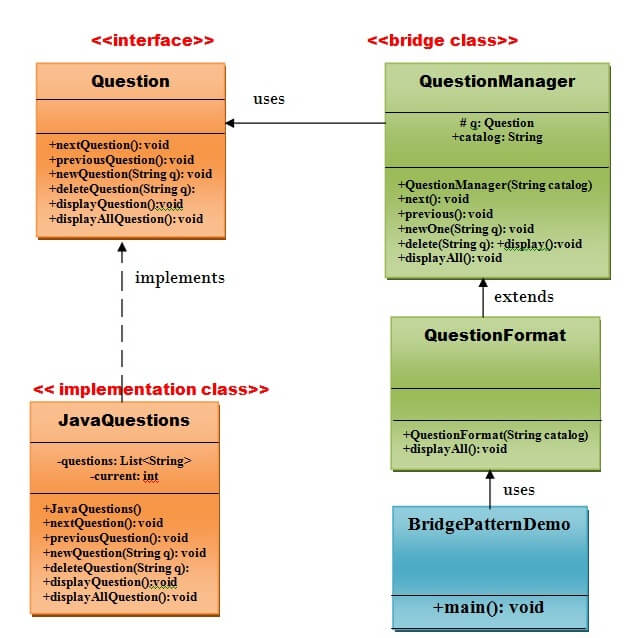

# Bridge Pattern

A Bridge Pattern says that just **"decouple the functional abstraction from the implementation so that the two can vary independently"**.
The Bridge Pattern is also know as **Handle or Body**.

### Advantage of Bridge Pattern
- It enables the separation of implementation for the interface.
- It improves the extensibility.
- It allows the hiding of implementation details from the client.

### Usage of Bridge Pattern
- When you don't want a permanent binding between the functional abstraction and its implementation.
- When both the functional abstraction and its implementation need to extend using subclasses.
- It is mostly used in those places where changes made in the implementation does not affect the clients.

## UML of Bridge Pattern

