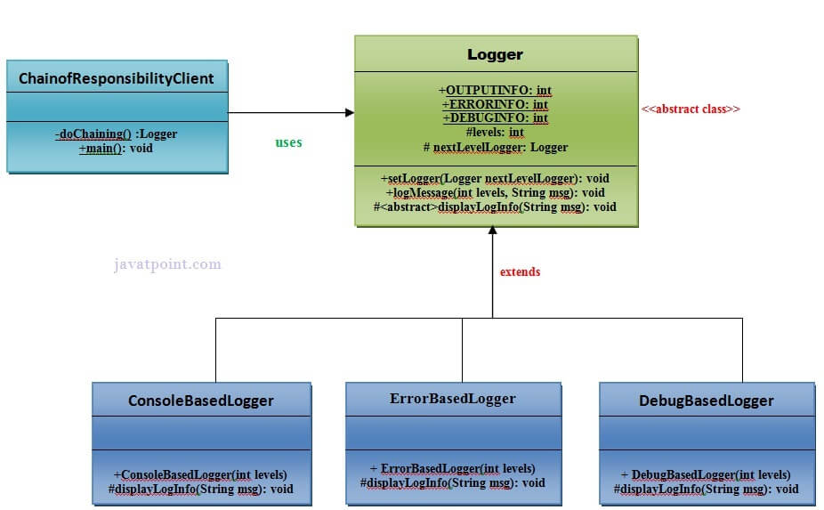

# Chain of Responsibility Pattern

In the chain of responsibility, the sender sends a request to a chain of objects. The request can be handled by any object in the chain.

The chain of responsibility pattern says that just **"avoid coupling the sender of a request to its receiver by giving multiple objects a chance to handle the request"**. For example, an ATM uses the chain of responsibility design pattern in the money giving process.

In other words, we can say that normally each receiver contains reference of another receiver. If one object cannot handle the request then it passes the same to the next receiver and so on.

## Advantages of the pattern

1. Reduces coupling
2. Add flexibility while assigning the responsibilities to objects.
3. Allows a set of classes to act as one; events produced in one class can be sent to other handler classes with the help of composition.

## Usage of chain of responsibility pattern

1. When more than one object can handle a request and the handler is unknown.
2. When the group of objects that can handle the request must be specified in dynamic way.

## Example of chain of responsibility pattern

### UML Diagram
 
