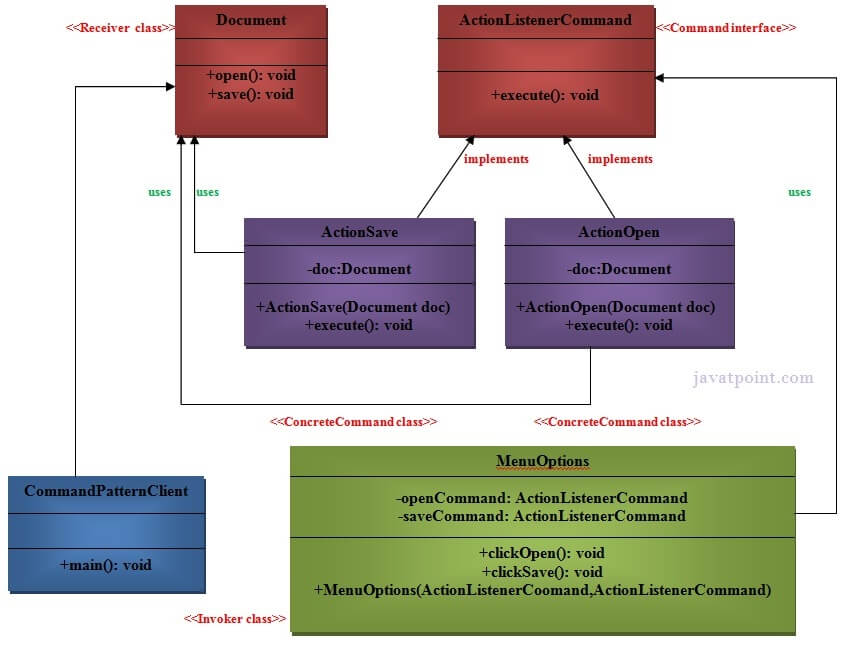

# Command Pattern

A Command Pattern says that ***"encapsulate a request under an object as a command and pass it to invoker object. Invoker object looks for the appropriate object which can handle this command and pass the command to the corresponding object and that object executes the command"***.

Command pattern is also known as **Action or Transaction**.

## Advantages of command pattern

1. It separates the object that invokes the operation from the object that actually performs the operation.
2. It makes it easy to add new commands, because existing classes remain unchanged.

## Usage of command pattern
1. When you need to parameterize the objects according to an action to perform.
2. When you need to create and execute requests at different times.
3. When you need to support rollback, logging and transaction functionality.

## Example of command pattern 

These are the components of the command design pattern in this example:
1. **Command** - This is an interface for executing an operation.
2. **ConcreteCommand** - This class extends the command interface and implements the execute method. This class creates a binding between the action and the receiver.
3. **Client** - This class creates the ConcreteCommand class and associates it with the receiver.
4. **Invoker** - This class asks the command to carry out the request.
5. **Receiver** - This class knows to perform the operation.

