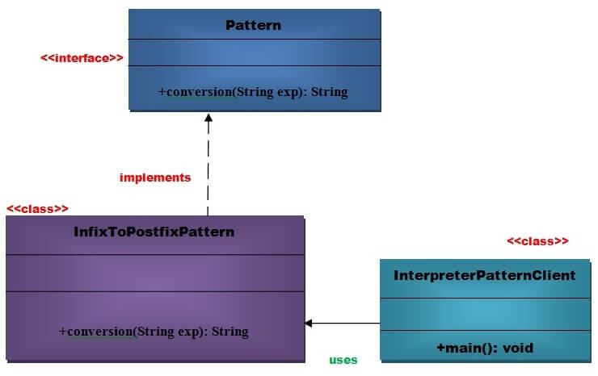

# Interpreter  pattern

An Interpreter Pattern says that:  **"define a representation of grammar of a given language, along with an interpreter that uses this representation to interpret sentences in the language"**.

Basically the Interpreter pattern has limited area where it can be applied. We can discuss the Interpreter pattern only in terms of formal grammars but in this area there are better solutions that is why it is not frequently used.

This pattern can be applied for parsing the expressions defined in simple grammar and sometimes in simple rule engines.

> Sql parsing uses interpreter design pattern.

## Advantages of interpreter pattern

1. It is easier to change and extend grammar.
2. Implementing the grammar is straightforward.

## Usage of interpreter pattern

1. When the grammar of the language is not complicated.
2. When the efficiency is not a priority.

## Example of the interpreter pattern

