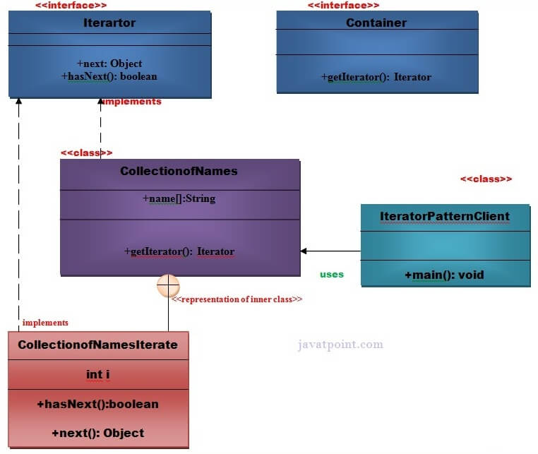

# Iterator Pattern

According to GoF, Iterator Pattern is used **"to access the elements of an aggregate object sequentially without exposing its underlying implementation"**.

The Iterator pattern is also known as **Cursor**.

In collection framework, we are now using Iterator that is preferred over Enumeration

> 📝 `java.util.Iterator` interface uses Iterator Design Pattern.

## Advantage of iterator pattern

- It supports variation in the traversal of a collection.
- It simplifies the interface to the collection.

## Usage of iterator pattern

1. When you want to access a collection of objects without exposing its internal representation.
2. Where there are multiple traversals of objects that need to be supported in the collection.

## Example of iterator pattern

