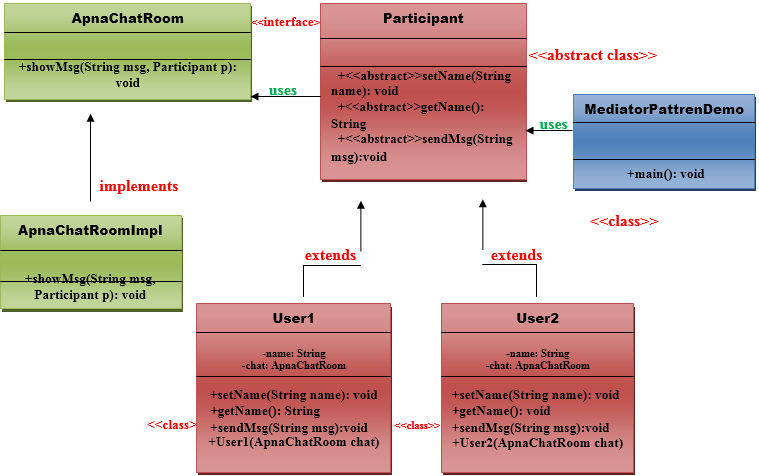

# Mediator Pattern

A Mediator Pattern says that **"to define an object that encapsulates how a set of objects interact"**.

I will explain the Mediator pattern by considering a problem. When we begin with development, we have a few classes and
these classes interact with each other producing results. Now, consider slowly, the logic becomes more complex when
functionality increases. Then what happens? We add more classes and they still interact with each other but it gets
really difficult to maintain this code now. So, Mediator pattern takes care of this problem.

Mediator pattern is used to reduce communication complexity between multiple objects or classes. This pattern provides a
mediator class which normally handles all the communications between different classes and supports easy maintainability
of the code by loose coupling.

## Benefits of mediator pattern

1. It decouples the number of classes.
2. It simplifies object protocols.
3. It centralizes the control.
4. The individual components become simper and easier to deal with because they don't need to pass messages to one
   another. The component don't need to contain logic to deal with their intercommunication and therefore, they are more
   generic.

## Usage

1. It is commonly used in message-based systems likewise chat applications.
2. When the set of objects communicate in complex but in well-defined ways.

## UML for mediator pattern

### Demo components

1. **ApnaChatroom** :- defines the interface for interacting with participants.
2. **ApnaChatroomImpl** :- implements the operations defined by the Chatroom interface. The operations are managing the interactions between the objects: when one participant sends a message, the message is sent to the other participants.
3. **Participant** :- defines an interface for the users involved in chatting.
4. **User1, User2, ...UserN** :- implements Participant interface; the participant can be a number of users involved in
   chatting. But each Participant will keep only a reference to the ApnaChatRoom.
