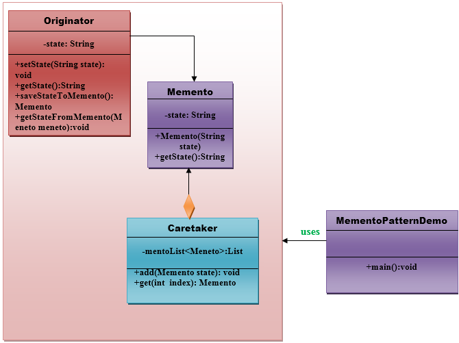

# Memento Pattern

A Memento Pattern says that **"to restore the state of an object to its previous state"**. But it must do this without
violating Encapsulation. Such case is useful in case of error or failure.

The Memento pattern is also known as **Token**.

Undo or backspace or ctrl+z is one of the most used operations in an editor. Memento design pattern is used to implement
the undo operation. This is done by saving the current state of the object as it changes state.

## Benefits

- It preserves encapsulation boundaries.
- It simplifies the originator.

## Usage of memento pattern

1. It is used in Undo and Redo operations in most software.
2. It is also used in database transactions.

## UML for memento pattern demo

### Components

#### Memento

- Stores internal state of the originator object. The state can include any number of state variables.
- The Memento must have two interfaces, an interface to the caretaker. This interface must not allow any operations or
  any access to internal state stored by the memento and thus maintains the encapsulation. The other interface is
  Originator, and it allows the Originator to access any state variables necessary to the originator to restore the
  previous state.

#### Originator

- Creates a memento object that will capture the internal state of Originator.
- Use the memento object to restore its previous state.

#### Caretaker

- Responsible for keeping the memento.
- The memento is transparent to the caretaker, and the caretaker must not operate on it.
