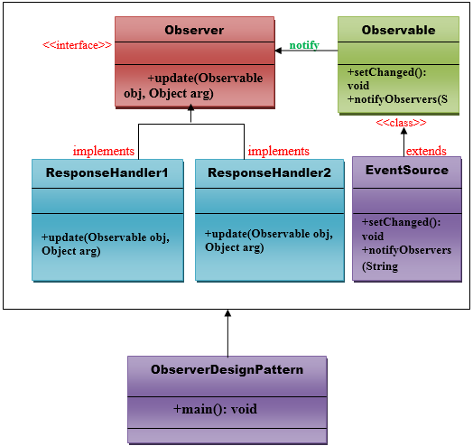

# Observer pattern

An Observer Pattern says that **"just define a one-to-one dependency so that when one object changes state, all its dependents are notified and updated automatically"**.

The observer pattern is also known as **Dependents** or **Publish-Subscribe**.

## Advantages
1. It describes the coupling between the objects and the observer.
2. It provides the support for broadcast-type communication.

## Usage

- When the change of state in one object must be reflected in another object without keeping the objects tight coupled.
- When the framework we wrote needs to be enhanced in the future and new observers needed to be added with minimal changes.

## UML for observer pattern

