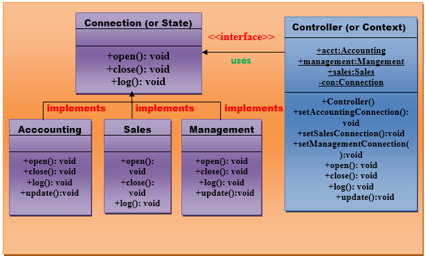

# State pattern

A State Pattern says that **"the class behavior changes based on its state". In State Pattern, we create objects which
represent various states and a context object whose behavior varies as its state object changes"**.

The State Pattern is also known as Objects for States.

## Advantages of state pattern

1. It keeps the state-specific behavior.
2. It makes any state transition explicit.

## Usage

- When the behavior of object depends on its state and it must be able to change its behavior at runtime according to
  the new state.
- It is used when the operations have large, multipart conditional statements that depend on the state of an object.

## UML for state pattern

