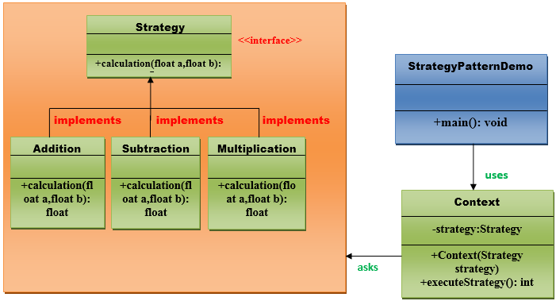

# Strategy pattern

A Strategy Pattern says that "defines a family of functionality, encapsulate each one, and make them interchangeable".

The Strategy Pattern is also known as Policy.

## Uml for strategy pattern

