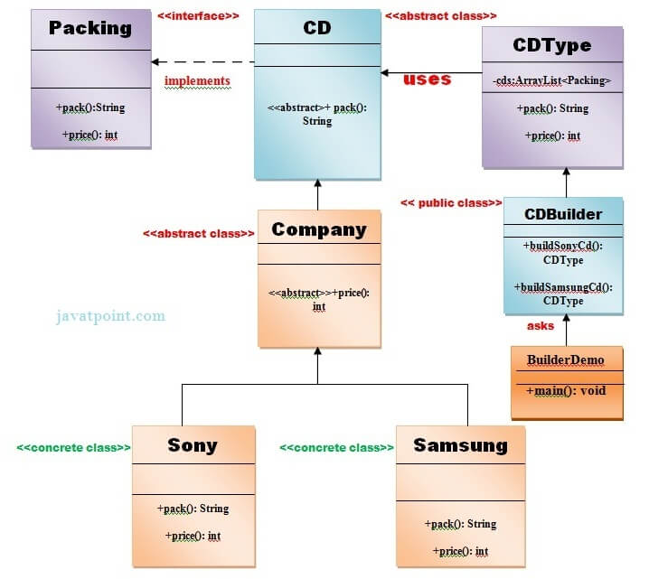
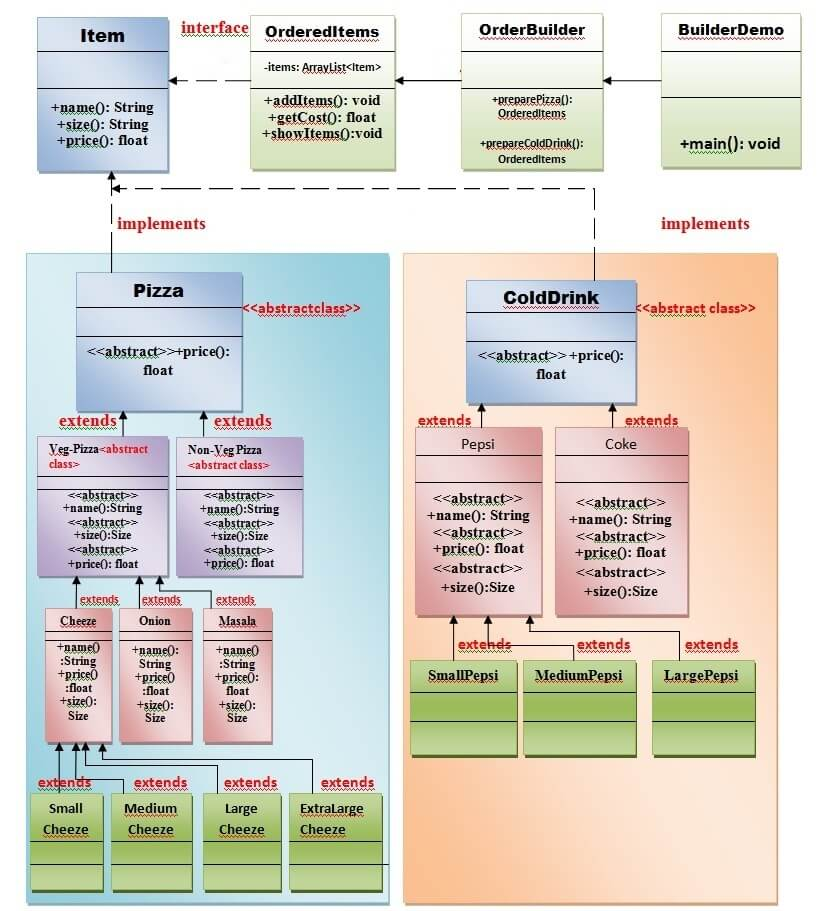

# Builder Design Pattern
Builder Pattern says that ***"construct a complex object from simple objects using step-by-step approach".***

It is mostly used when the object can't be created in a single step like in the de-serialization of a complex object.

## Advantage of Builder Design Pattern
The main advantages of Builder Patters are as follows:
* It provides clear separation between the construction and representation of an object.
* It provides better control over construction process.
* It supports the change the internal representation of objects.

## UML for Builder Pattern Example

### In this directory, we will demonstrate an example of the Builder Design Pattern:
To create a simple example of builder design pattern, you need to follow the following steps.
1. Create a Packing Interface.
2. Create two abstract classes (CD and Company).
3. Create two implementation classes of Company: Sony and Samsung.
4. Create the CDType class.
5. Create the CDBuilder class.
6. Create the BuilderDemo class.
    
    
    Note: The code for the CD Builder Demo is on the `cdBuilderDemo` directory.

### Another Real World Example of Builder Design Pattern
**UML for the OrderBuilderDemo**

We are considering a business case of **pizza-hut** where we can get different varieties of pizza and cold-drink.

**Pizza** can be either a Veg pizza or Non-Veg pizza of several types (like cheese pizza, onion pizza, masala pizza etc.) and will be of 4 sizes i.e small, medium, large, and extra-large.

***Cold-drink*** can be of several types (like Pepsi, Coke, Dew, Sprite, Fanta, Maaza, Limca etc.) and will be of 3 sizes i.e. small, medium, and large.

- Step 1: **Create an interface item that represents the Pizza and Cold-drink**.
- Step 2: **Create and abstract class Pizza that will implement to the interface item.**
- Step 3: **Create an abstract class ColdDrink that will implement to the interface item.**
- Step 4: **Create an abstract class VegPizza that will extend to the abstract class Pizaa.**
- Step 5: **Create an abstract class NonVegPizza that will extend to the abstract class Pizza.**
- Step 6: **Now, create concrete subclasses SmallCheesePizza, MediumCheesePizza, LargeCheesePizza, ExtraLargeCheesePizza that will extend to the abstract class VegPizza.**
- Step 7: **Now, similarly create concrete subclasses SmallOnionPizza, MediumOnionPizza, LargeOnionPizza, ExtraLargeOnionPizza that will extend to the abstract class VegPizza.**
- Step 8: **Now, similarly creat concrete subclasses SmallMasalaPizza, MediumMasalaPizza, LargeMasalaPizza, ExtraLargeMasalaPizza that will extend to the abstract class VegPizza.**
- Step 9: **Now, create concrete subclasses SmallNonVegPizza, MediumNonVegPizza, LargeNonVegPizza, ExtraLargeNonVegPizza that will extend to the abstract class NonVegPizza.**
- Step 10: **Now, create two abstract classes Pepsi and Coke that wil extend abstract class ColdDrink.**
- Step 11: **Now, create concrete subclasses SmallPepsi, MediumPepsi, LargePepsi that will extend to the abstract class Pepsi.**
- Step 12: **Now, create concrete subclasses SmallCoke, MediumCoke, LargeCoke that will extend to the abstract class Coke.**
- Step 13: **Create an OrderItems class that have item objects defined.**
- Step 14: **Create an OrderBuilder class that will be responsible to create the objects of OrderedItem class.**
- Step 15: **Create a BuilderDemo class that will use the OrderBuilder class.**
- 
