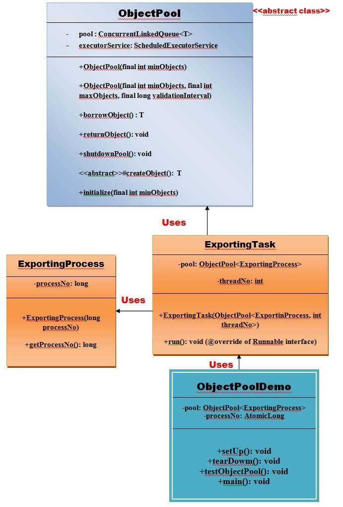

# Object Pool Pattern

Mostly, performance is the key issue during the software development and the object creation, which may be a costly step.

Object Pool pattern says that **"to reuse the objects that are expensive to create"**. Basically, an Object Pool is a container which contains a specified amount of objects. When an object is taken from the pool, it is not available in the pool until it is put back. **Objects in the pool have a lifecycle: creation, validation and destroy.**
A pool helps to manage available resources in a better way. There are many using examples: especially in application servers there are data source pools, thread pools etc.

### Advantage of Object Pool design pattern:
- It boots the performance of the application significantly.
- It is most effective in a situation where the rate of initializing a class inheritance is high.
- It manages the connections and provides a way to reuse and share them.
- It can also provide the limit for the maximum number of objects that can be created.

### Usage:
- When an application requires objects which are expensive to create: Eg. there is a need of opening too many connections for the database then it takes longer to create new one and the database server will be overloaded.
- When there are several clients who need the same resource at different times.

## Example of Object Pool Pattern

