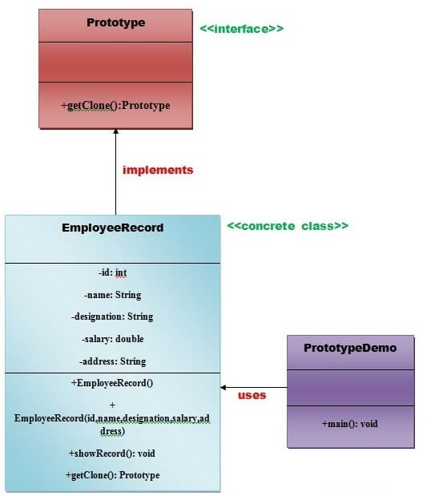

# Prototype Design Pattern
Prototype Pattern says that ***cloning of an existing object instead of creating new one and can also be customized as per the requirement.***

This pattern should be followed , if the cost of creating a new object is expensive and resource intensive.

## Advantage of Prototype Pattern
The main advantages of prototype pattern are as follows:
 * It reduces the need of sub-classing.
 * It hides complexities of creating new objects.
 * The client can get new objects without knowing which type of object it will be.
 * It lets you add or remove objects at runtime.

## Usage of Prototype Pattern
 * When the class are instantiated at runtime.
 * When the cost of creating objects is expensive and complicated.
 * When you want to keep the number of classes in an application minimum.
 * When the client application needs to be unaware of object creation and representation.

## UML for Prototype Pattern

In this directory:
* We are going to create an **interface Prototype** that contains a method **getClone()** of **Prototype type**.
* Then, we create a **concrete class EmployeeRecord** which implements **Prototype Interface** that does the cloning of `EmployeeRecord` object.
* **Prototype Demo class** will use this **EmployeeRecord**.