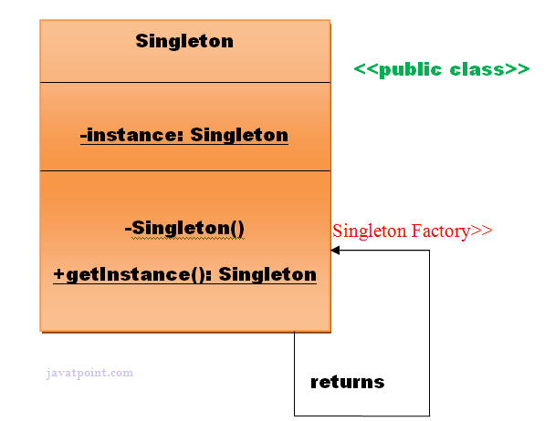

# Singleton Design Pattern in java:
____
Singleton pattern says that just  **"define a class that has only one instance and provides
global point of access to it"**.

In other words a class must ensure that only single instance should be created and 
a single object can be used by all other classes.

There are two forms of singleton design pattern:
* **Early Instantiation** - creation of  instance at load time.
* **Lazy Instantiation** - creation of instance when required.
### Advantage of Singleton Design Pattern:
* Saves memory because object is not created at each request. Only single instance is
reused again and again.
### Usage of Singleton Design Pattern:
* Singleton pattern is mostly used in multithreaded and database applications. It is
used in logging, caching, thread pools, configuration settings etc.
### To creat a singleton class, we need to have static member of class, private constructor and static factory method:
* **Static member:** It gets memory only once because it's static, it contains the instance of 
the Singleton class.
* **Private constructor:** It will prevent to instantiate the Singleton class from outside
the class.
* **Static Factory Method:** This provides the global point of access to the singleton
object and returns the instance to the caller.
### UML for Singleton Design Pattern
