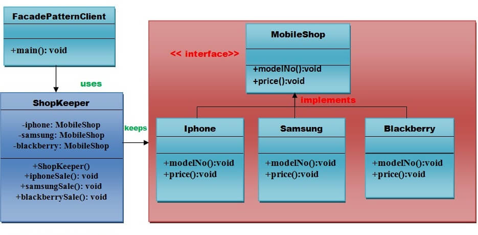

# Facade Pattern

Facade pattern states that **"just provide a unified and simplified interface to a set of interfaces in a subsystem, therefore it hides the complexities of the subsystem from the client"**.

In other words, the facade pattern describes a higher level interface that makes the sub-system easier to use.

> Practically, every **Abstract Factory** is a type of Facade.

## Advantages

- It shields the clients from the complexities of the subsystem components.
- It provides loose coupling between subsystems and clients.

## Usage of Facade Pattern

- When you want to provide simple interface to a complex sub-system.
- When several dependencies exist between client and the implementation classes of an abstraction.

# Examples of Facade Patterns

## UML diagram

