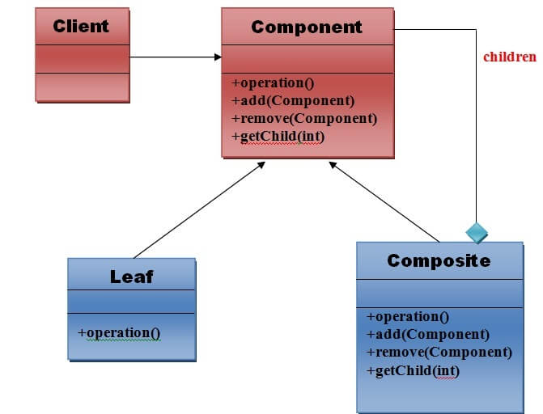
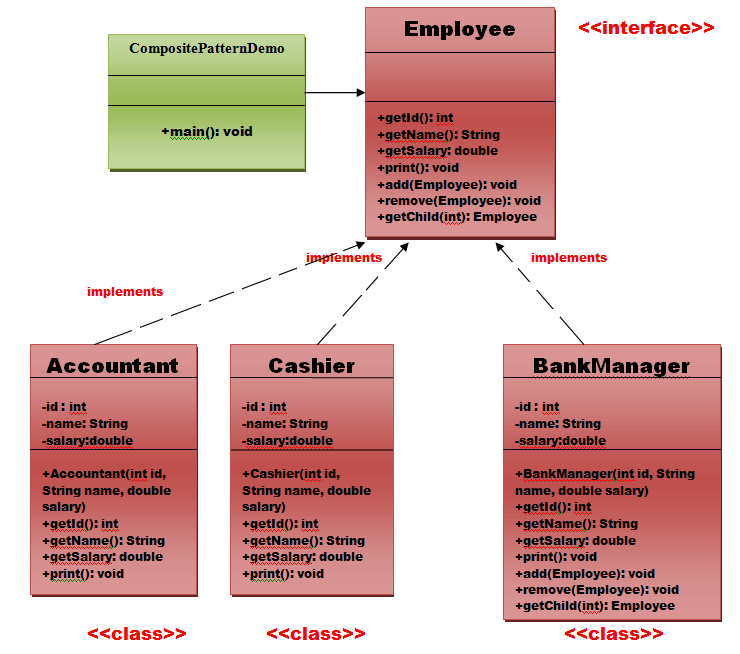

# Composite Pattern

A Composite Pattern says that just **"allow clients to operate in generic manner on objects that may or may not represent a hierarchy of objects".**

### Advantage of Composite Design Pattern
1. It defines class hierarchies that contain primitive and complex objects.
2. It makes easier to you to add new kinds of components.
3. It provides flexibility of structure with manageable class or interface.

### Usage of Composite Pattern
* When you want to represent a full or partial hierarchy of objects.
* When the responsibilities are needed to be added dynamically to the individual objects without affecting other objects. Where the responsibility of object may vary from time to time.

## UML for Composite Pattern

### Elements used in Composite Pattern:
Let's see the 4 elements of composte pattern.

1) **Component** |
   Declares interface for objects in composition.
   Implements default behavior for the interface common to all classes as appropriate.
   Declares an interface for accessing and managing its child components.
2) **Leaf** |
   Represents leaf objects in composition. A leaf has no children.
   Defines behavior for primitive objects in the composition.
3) **Composite** |
   Defines behavior for components having children.
   Stores child component.
   Implements child related operations in the component interface.
4) **Client** |
   Manipulates objects in the composition through the component interface.

Client uses the component class interface to interact with objects in the composition structure. If recipient is the leaf then request will be handled directly. If recipient is a composite, then it usually forwards the request to its child for performing the additional operations.

## Example of Composite Pattern
We can easily understand the example of composite design pattern by the UML diagram given below:
 

